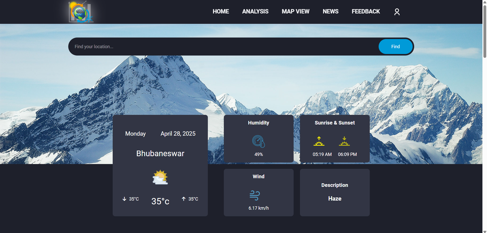
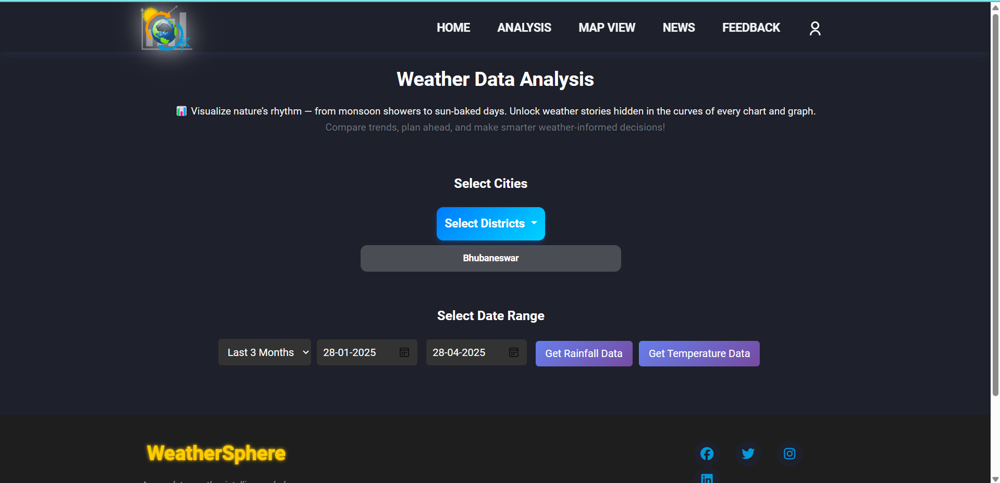
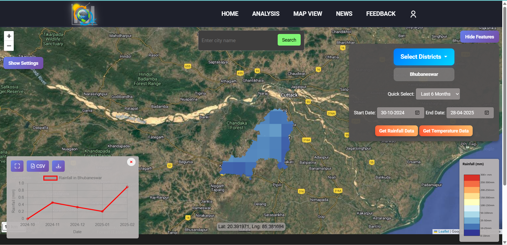
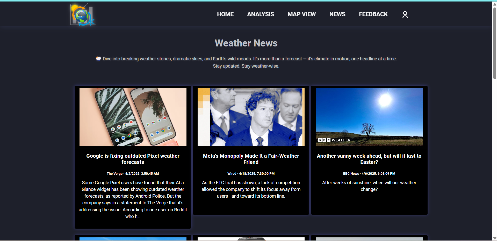
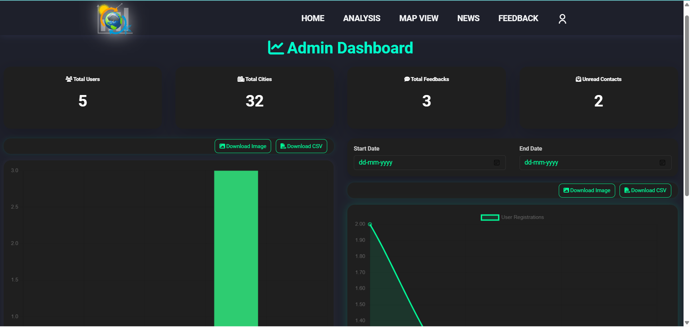
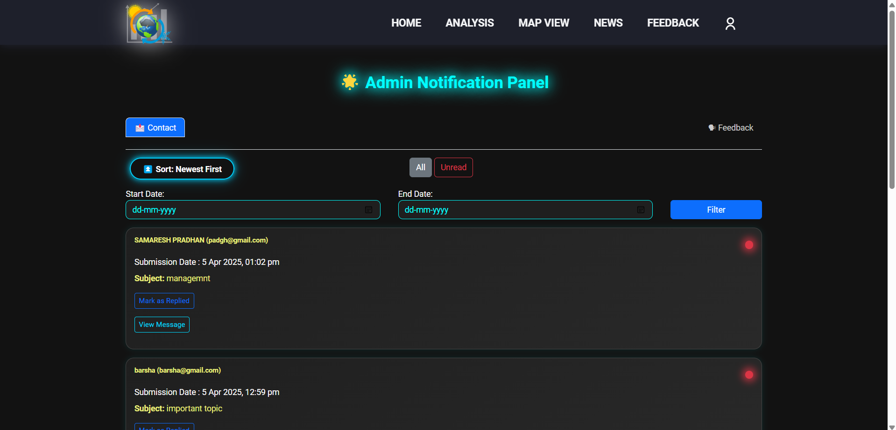

# 🌦️ WeatherSphere

**WeatherSphere** is a complete weather intelligence hub that provides real-time weather updates, 5-day forecasts, weather news, interactive maps, and historical analysis powered by satellite data from Google Earth Engine.

---

## 🔥 Features

- 🌍 Real-time weather updates by city
- 📅 5-day weather forecasts
- 📰 Latest weather news in card format
- 🗺️ Interactive map showing live & forecasted weather
- 📊 Historical temperature & rainfall charts
- 🛰️ Satellite data integration (Google Earth Engine)
- 📥 Download weather data as CSV & image
- ✉️ Feedback and contact system with filtering, sorting & modal views
- 🔐 Forgot password with OTP verification via email
- 🧑‍💼 Admin dashboard with:
  - 👥 User management (activate/deactivate)
  - ⭐ Feedback trends & statistics
  - 📨 Contact message tracking (read/unread)

---

## 🛠️ Tech Stack

- **Frontend**: HTML, CSS, Bootstrap, JavaScript, jQuery
- **Backend**: Python Flask
- **Database**: PostgreSQL
- **Satellite Data**: Google Earth Engine (GEE)
- **Charting Library**: Chart.js

---

## 📸 Screenshots

### 🏠 Landing Page

### 🏡 Home Page

### 📈 Historical Analysis (Temperature/Rainfall)

### 🗺️ Weather Map

### 📰 Weather News

### 💬 Feedback Form

### 🧑‍💼 Admin Dashboard Overview

### 👥 User Management

### 🔔 Notifications (Feedback & Contact)

---

## 🔐 Forgot Password Feature

- Users can reset their password via OTP sent to their registered email.
- Secure validation ensures only verified users can change their password.

---

## 👤 Author

- **Samaresh Pradhan**  
  GitHub: [@SAMARESH-PRADHAN](https://github.com/SAMARESH-PRADHAN)

---

## 📬 Contact

📧 Email: pradhansamaresh2002@gmail.com  
📱 Mobile: +91-7978961272

---

## 📝 License

This project is open-source and free to use under the [MIT License](LICENSE).
